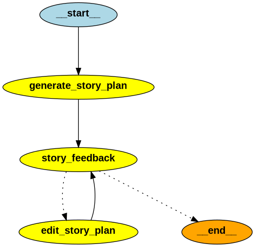
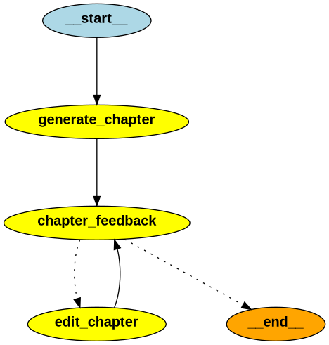

# 엔드투엔드 오케스트레이션: 스토리라인 생성 → 챕터 순차 생성

API 요청부터 Celery 작업 체인, 서비스 레이어, LangGraph 실행까지의 전체 흐름을 요약합니다.

1) API 진입점: 스토리 생성 요청
- 엔드포인트: `POST /stories`
- 구현: `backend/app/api/routes/stories.py#create_story`
- 동작: 새로운 `story_id`를 발급하고, Celery 체인으로 “스토리(스토리라인/플랜) 생성 → 챕터 생성”을 순차 실행합니다.

```python
@router.post("/stories", response_model=StoryCreateResponse)
def create_story(req: StoryCreateRequest) -> StoryCreateResponse:
    story_id = str(uuid.uuid4())
    task_chain = chain(
        generate_story_task.si(req.model_dump_json(), story_id)
        | generate_chapters_task.si(story_id)
    )
    task_chain.delay()
    return StoryCreateResponse(story_id=story_id, status="PENDING")
```

2) 스토리라인(스토리 플랜) 생성 단계
- 첫 번째 태스크 `generate_story_task`가 스토리 메타데이터와 스토리라인(챕터 플롯 목록)을 생성·저장합니다.
- 내부 품질 관리는 `storyplan_graph`의 피드백 루프(임계값/편집 제한)로 수행될 수 있으며, 확정된 플롯은 다음 단계 입력으로 사용됩니다.

3) 챕터 순차 생성 단계 (서비스 레이어)
- 두 번째 태스크 `generate_chapters_task`는 `chapter_service.create_chapter(story_id)`를 호출하여 챕터를 플롯 순서대로 하나씩 생성합니다.
- 구현: `backend/app/services/chapter_service.py#create_chapter`
  - DB에서 `story`와 `chapter_plots`를 조회합니다.
  - 스토리 생성 시각(UTC) 기준으로 KST(Asia/Seoul)에 맞춰 기본 공개 기준 시간을 계산하고, `CHAPTERS_PER_DAY` 정책에 따라 각 챕터의 공개 가능 시간(`available_utc`)을 일자 단위로 분산 예약합니다.
  - `previous_summary`를 누적·전달하면서 각 플롯에 대해 `chapter_graph.invoke({...})`로 본문을 생성/편집 루프를 거쳐 확정합니다.
  - 결과를 모델로 변환·저장하고(`chapter_repo.save`), 다음 챕터를 위해 `previous_summary`를 갱신합니다.
  - 모든 작업이 성공하면 스토리 상태를 `READY`, 예외 발생 시 `FAILED`로 업데이트합니다.

핵심 포인트
- 스토리라인(플롯) → 챕터 본문 생성이 순차적으로 이어지며, `previous_summary` 체이닝으로 서사적 연속성을 유지합니다.
- 각 챕터는 생성 시각과 배포 정책(`CHAPTERS_PER_DAY`)에 따라 공개 가능 시간이 예약됩니다.
- 챕터 본문 품질은 `chapter_graph`의 피드백 루프(임계값·편집 제한)에 의해 관리됩니다.

---

# FanTale LangGraph 워크플로우
`app/agents/graph.py`에 정의된 두 개의 LangGraph 워크플로우 동작을 설명합니다.
- `storyplan_graph` — 스토리 플랜을 생성하고 반복적으로 개선
- `chapter_graph` — 챕터를 작성하고 반복적으로 개선

두 워크플로우 모두 피드백 루프를 통해 품질 임계값을 충족하거나 편집 횟수 제한에 도달할 때까지 수정 과정을 반복합니다.

---

## 시각적 개요

다이어그램은 `graph.get_graph(xray=True)`로 생성해서 `draw_png(...)`로 저장했습니다.

- 스토리 플랜 워크플로우

  

- 챕터 워크플로우

  

---

## 공통 파라미터와 개념

- 품질 임계값
  - `MINIMUM_STORYPLAN_SCORE = 7`
  - `MINIMUM_CHAPTER_SCORE = 7`
- 편집 횟수 제한
  - `MAX_NUM_STORYPLAN_EDIT = 4`
  - `MAX_NUM_CHAPTER_EDIT = 2` # 최소 10개 이상의 챕터 생성에서 2번만 해도 꽤 많은 토큰(20*2*400)을 소비하기 때문에 
- 각 워크플로우의 점수는 세 가지 피드백 점수의 평균으로 계산됩니다.
- 편집을 수행할 때마다 해당 상태의 `num_edits`가 증가합니다.

---

## 스토리 플랜 워크플로우 (`storyplan_graph`)

### 상태: `StoryPlanState`
- `genre: str`
- `character_descriptions: str`
- `story_plan: StoryPlan` — 현재 스토리 플랜 산출물
- `cliche_feedback: FeedBack`
- `storyline_feedback: FeedBack`
- `character_feedback: FeedBack`
- `num_edits: int` — 편집 횟수

### 노드
1. `generate_story_plan`
   - `generate_story_plan(genre, character_descriptions)` 호출
   - 초기 `StoryPlan`을 생성하여 `state["story_plan"]`에 저장

2. `story_feedback`
   - `generate_story_plan_feedback(genre, story_plan)` 호출
   - `cliche_feedback`, `storyline_feedback`, `character_feedback` 필드 채움

3. `edit_story_plan`
   - `edit_story_plan(genre, story_plan, feedback)` 호출
   - `state["story_plan"]` 업데이트 및 `state["num_edits"]` 증가
   - 예외 발생 시 로깅 후 이전 플랜 유지(서버 안정성 확보)

### 제어 흐름
- `START → generate_story_plan → story_feedback`
- 조건 분기:
  - 평균 점수 < `MINIMUM_STORYPLAN_SCORE` AND `num_edits` < `MAX_NUM_STORYPLAN_EDIT` → `edit_story_plan`
  - 그 외 → `END`
- `edit_story_plan → story_feedback` (종료 조건까지 루프)

---

## 챕터 워크플로우 (`chapter_graph`)

### 상태: `ChapterState`
- `genre: str`
- `title: str`
- `character_descriptions: str`
- `previous_summary: str`
- `chapter_plot: str`
- `total_summary: str`
- `content: str`
- `cliche_feedback: FeedBack`
- `detail_feedback: FeedBack`
- `novelist_feedback: FeedBack`
- `num_edits: int` — 편집 횟수

### 노드
1. `generate_chapter`
   - 장르/제목/캐릭터/플롯/요약 정보를 바탕으로 `generate_chapter(...)` 호출
   - 결과 `ChapterOutput.content`를 `state["content"]`에 저장

2. `chapter_feedback`
   - `generate_chapter_feedback(content)` 호출
   - `cliche_feedback`, `detail_feedback`, `novelist_feedback` 필드 채움

3. `edit_chapter`
   - `edit_chapter(chapter_content, cliche_feedback, detail_feedback, novelist_feedback)` 호출
   - `state["content"]` 업데이트 및 `state["num_edits"]` 증가

### 제어 흐름
- `START → generate_chapter → chapter_feedback`
- 조건 분기:
  - 평균 점수 < `MINIMUM_CHAPTER_SCORE` AND `num_edits` < `MAX_NUM_CHAPTER_EDIT` → `edit_chapter`
  - 그 외 → `END`
- `edit_chapter → chapter_feedback` (종료 조건까지 루프)

---

## 점수와 종료 조건

각 워크플로우의 평균 점수는 다음과 같이 계산합니다.

- 스토리 플랜: `(cliche_feedback.score + storyline_feedback.score + character_feedback.score) / 3`
- 챕터: `(cliche_feedback.score + detail_feedback.score + novelist_feedback.score) / 3`

평균 점수가 최소 임계값보다 낮고, 편집 횟수가 최대 허용치를 넘지 않은 경우에만 편집을 계속합니다. 그렇지 않으면 워크플로우가 종료됩니다.
(점수 로직 고도화 or Agent Supervisor 처리)
